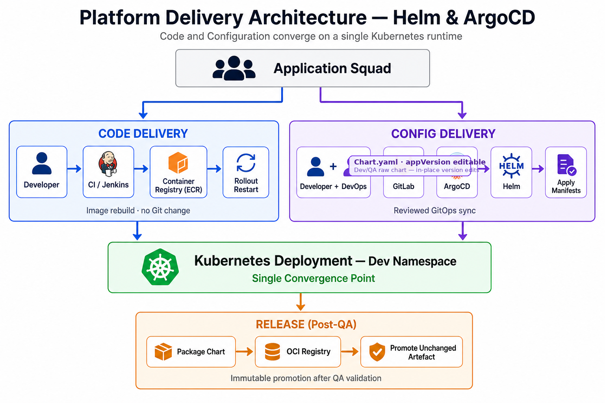
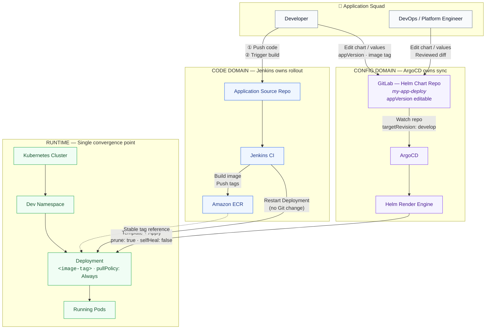
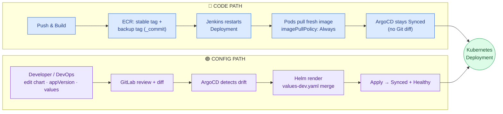
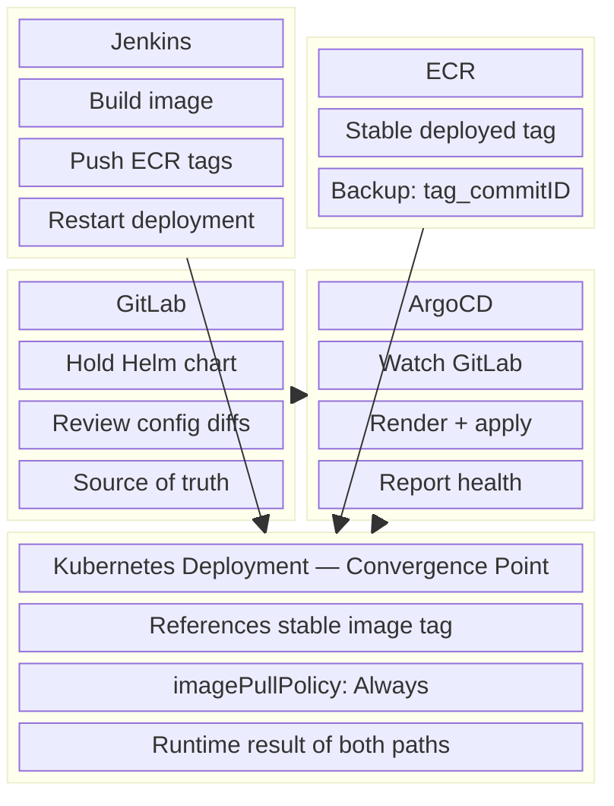
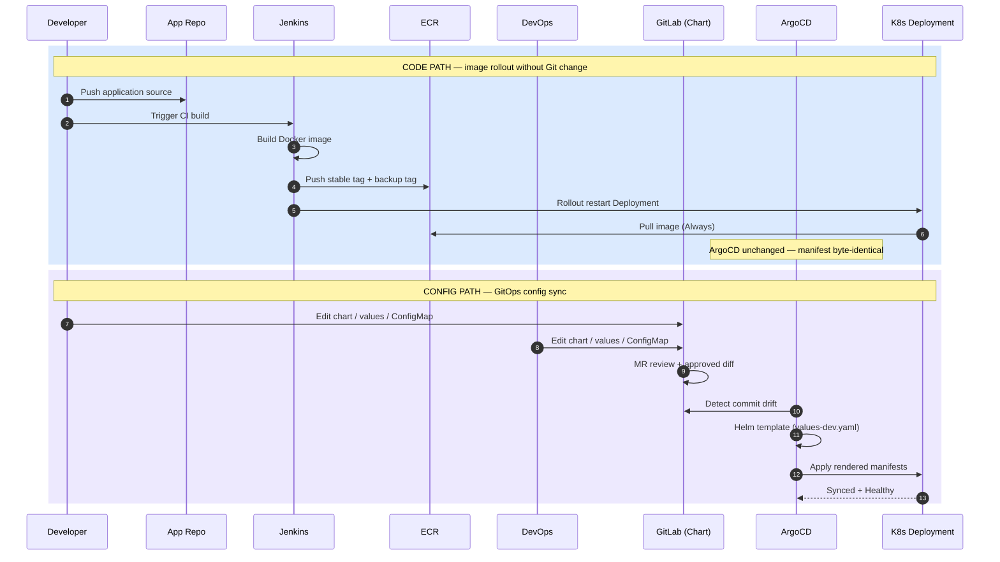
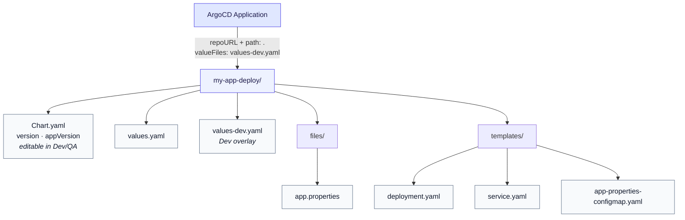
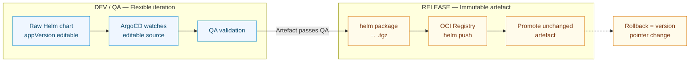
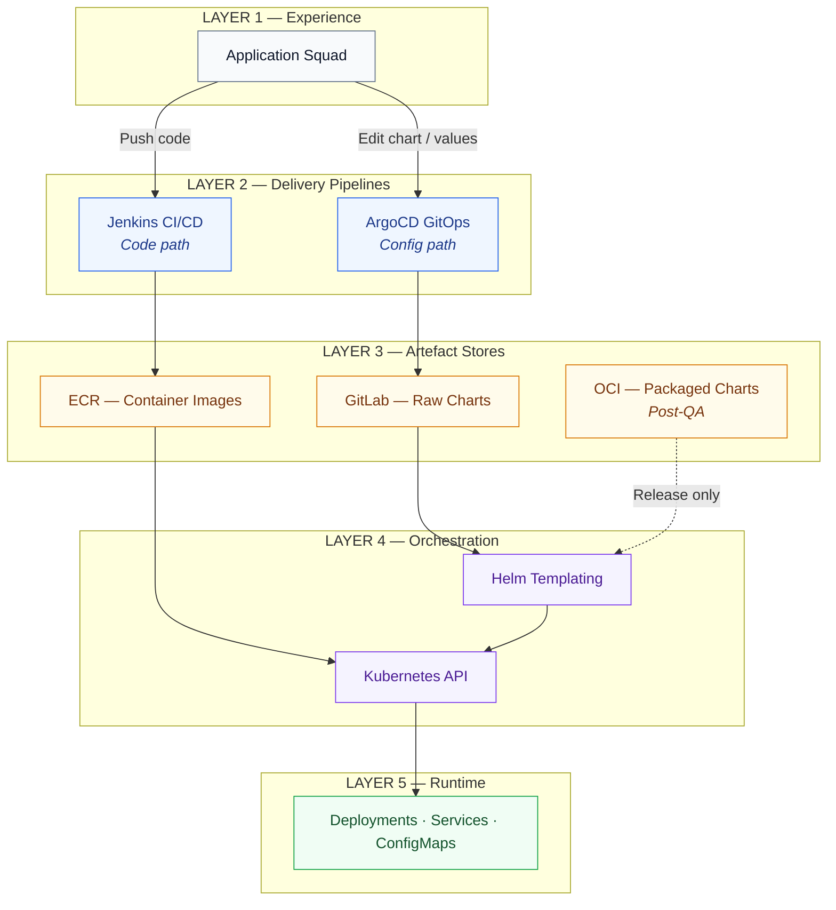
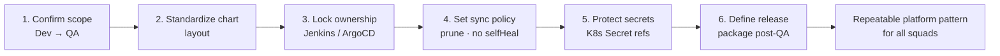

# Platform Delivery Architecture
## Shipping with Helm & ArgoCD — Dev → QA

> Derived from **SA_Guils_proposal.pptx**  
> Scope: Development through QA · Staging and Production to follow



---

## 1. System Context — Delivery Contract

The platform separates **application code** from **environment/configuration**. Each path has one owner, one trigger, and one convergence point: the **Kubernetes Deployment** in the Dev namespace.



---

## 2. Dual-Path Architecture — Code vs Config



### Boundary Rule
> **Jenkins** owns fresh image rollout. **ArgoCD** owns Git-declared configuration.  
> `selfHeal: false` prevents the two systems from fighting over the same Deployment.

---

## 3. Component Ownership Model



| Component | Responsibility | Does NOT do |
|-----------|---------------|-------------|
| **Jenkins** | Build, tag, push image, restart pods | Edit Git / Helm values |
| **ECR** | Store immutable image artefacts | Deploy or configure cluster |
| **GitLab** | Version Helm charts & values | Build application images |
| **ArgoCD** | Sync declared config to cluster | Rebuild images or restart for code |
| **Deployment** | Run workloads at declared state | Act as independent automation |

---

## 4. End-to-End Sequence — Develop to Deployment



---

## 5. GitLab Chart Layout (Dev/QA Standard)



### Editable App Version (Dev/QA)

During Dev and QA, the Helm chart stays as **raw, editable source files** in GitLab — not a packaged `.tgz`. ArgoCD watches `repoURL + path` and renders the chart directly, so version fields can be changed in place and reviewed through a normal Git diff.

| Field | Where | Editable in Dev/QA? | Purpose |
|-------|-------|---------------------|---------|
| `appVersion` | `Chart.yaml` | **Yes** | Declares the application release label (metadata + labels) |
| `version` | `Chart.yaml` | **Yes** | Chart packaging version while iterating in Git |
| `image.tag` | `values-dev.yaml` | **Yes** | Pin or override the container image tag for the environment |
| Packaged chart | OCI registry | **No** (post-QA) | Immutable artefact promoted unchanged after QA |

**Example — editable fields in Dev/QA**

```yaml
# Chart.yaml — appVersion is editable; bump here for config-path releases
apiVersion: v2
name: my-app
description: SA Guild sample deploy chart
type: application
version: 0.3.0        # chart version — editable during iteration
appVersion: "2.4.1"   # app version — editable in Dev/QA raw chart
```

```yaml
# values-dev.yaml — image tag override (config path)
image:
  repository: 123456789012.dkr.ecr.eu-west-1.amazonaws.com/my-app
  tag: "2.4.1"        # editable — ArgoCD sync applies on merge
```

**Boundary:** The **code path** refreshes running pods via Jenkins rollout restart without a Git change. The **config path** owns `appVersion`, chart `version`, and values overlays — including image tag when declared in Git.

### ArgoCD Application Contract (Minimum Wiring)

```yaml
source:
  repoURL: https://gitlab.com/org/my-app-deploy.git
  targetRevision: develop
  path: .
  helm:
    valueFiles:
      - values-dev.yaml
destination:
  server: https://kubernetes.default.svc
  namespace: dev
syncPolicy:
  automated:
    prune: true      # removed Git resources deleted from cluster
    selfHeal: false  # do not undo Jenkins rollout restarts
```

---

## 6. Release & QA Promotion Architecture



**Release command pattern**
1. Bump `Chart.yaml` version
2. `helm package ./my-app-deploy`
3. `helm push my-app-1.0.0.tgz oci://registry/charts`

**Promotion principle:** The artefact that passes QA is the artefact promoted to Release — unchanged.

---

## 7. Layered Platform View



---

## 8. Design Principles Summary

| Principle | Implementation |
|-----------|----------------|
| **Separation of concerns** | Code → Jenkins · Config → ArgoCD |
| **Single source of truth** | GitLab for config · ECR for images |
| **No automation collision** | `selfHeal: false` on ArgoCD Application |
| **Traceable releases** | Versioned charts · commit backup tags |
| **Safe rollback** | Revert chart version pointer (config) or previous image tag (code) |
| **Dev/QA flexibility** | Raw editable charts — `appVersion` and values in GitLab |
| **Release immutability** | Package to `.tgz` → push to OCI only after QA pass |

---

## 9. Adoption Readiness Checklist



---

*One split. One source of truth. Code changes via Jenkins. Config changes via GitLab + ArgoCD. Kubernetes Dev is the running result.*
