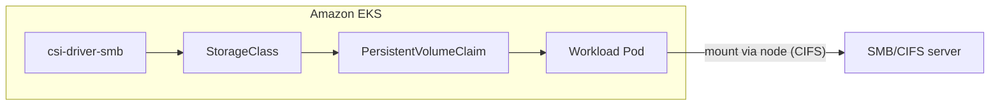

# SMB / CIFS persistent storage on Amazon EKS

This folder documents how to mount **SMB/CIFS** shares on **Amazon EKS** using the upstream [Kubernetes CSI Driver for SMB](https://github.com/kubernetes-csi/csi-driver-smb) (`csi-driver-smb`).

Typical backends:

- On-premises Windows Server or Samba file shares
- **Amazon FSx for Windows File Server** (managed SMB on AWS)
- **Amazon FSx for NetApp ONTAP** (SMB export)

## Architecture



Pods use a **PersistentVolume** backed by the CSI driver. The driver runs mount helpers on the **node** (not in the pod network namespace for the actual CIFS mount), so **worker nodes** must reach the SMB endpoint on TCP **445** (and DNS must resolve the server name).

## Prerequisites

| Requirement | Notes |
|-------------|--------|
| EKS cluster | 1.25+ recommended; IRSA-enabled cluster is fine |
| Node OS | `cifs-utils` on Linux nodes (see `k8s/node-prep-cifs-utils.yaml`) |
| Network | Security groups / NACLs / on-prem firewall allow **node → SMB:445** |
| Credentials | Domain or local user with share access; stored in a Kubernetes `Secret` |
| GitOps / Helm | Driver install is usually Helm or a GitOps Application |

## Quick start

### 1. Install the CSI driver (Helm)

```bash
helm repo add csi-driver-smb https://raw.githubusercontent.com/kubernetes-csi/csi-driver-smb/master/charts
helm repo update

helm upgrade --install csi-driver-smb csi-driver-smb/csi-driver-smb \
  --namespace kube-system \
  --set linux.enabled=true \
  --wait
```

Verify:

```bash
kubectl get pods -n kube-system -l app.kubernetes.io/name=csi-driver-smb
```

### 2. Prepare nodes (`cifs-utils`)

Apply the optional DaemonSet in `k8s/node-prep-cifs-utils.yaml` **or** bake `cifs-utils` into your AMI / node image (preferred for production).

### 3. Create SMB credentials

Edit `k8s/secret-smb.yaml` (replace placeholders), then:

```bash
kubectl apply -f k8s/secret-smb.yaml
```

### 4. StorageClass, PVC, and sample workload

```bash
kubectl apply -f k8s/storageclass-smb.yaml
kubectl apply -f k8s/pvc-smb.yaml
kubectl apply -f k8s/deployment-smb-mount.yaml
```

Check mount:

```bash
kubectl exec deploy/smb-mount-demo -- ls -la /data
```

## Configuration reference

### StorageClass parameters

| Parameter | Description |
|-----------|-------------|
| `source` | UNC path `//server/share` |
| `csi.storage.k8s.io/node-stage-secret-name` | Secret with `username` / `password` |
| `mountOptions` | e.g. `dir_mode=0755`, `file_mode=0644`, `uid=1000`, `gid=1000` |

See `k8s/storageclass-smb.yaml` for a concrete example.

### FSx for Windows File Server

1. Create FSx Windows in the same VPC as the EKS data plane (or connected network).
2. Join the file system to AD (or use local users per FSx docs).
3. Allow inbound **445** from the EKS node security group on the FSx security group.
4. Set `source` to `//amznfsx<dns>/share` from the FSx management console.

### Security

- Prefer **IRSA** and external secrets operators for credential rotation where possible; the CSI driver still consumes a standard `Secret` at mount time.
- Restrict `StorageClass` creation with RBAC; SMB credentials in Secrets are highly sensitive.
- Use private connectivity (VPC peering, Transit Gateway, Direct Connect) for on-prem SMB.

## GitOps layout

Suggested paths for Argo CD / Flux:

- `eks/smb-cifs/k8s/` — driver prerequisites, `StorageClass`, shared secrets (sealed / externalized in prod)
- Application workloads reference `persistentVolumeClaim` by name

## Troubleshooting

| Symptom | Likely cause |
|---------|----------------|
| `mount error(13): Permission denied` | Wrong user/password or share ACL |
| `Host is down` / timeout | SG, routing, or SMB blocked between **nodes** and server |
| `mount: wrong fs type` | `cifs-utils` missing on node |
| PVC stuck `Pending` | CSI controller not running or invalid `StorageClass` |

Controller logs:

```bash
kubectl logs -n kube-system -l app=csi-smb-controller -c smb --tail=100
```

Node plugin logs:

```bash
kubectl logs -n kube-system -l app=csi-smb-node -c smb --tail=100
```

## Files

| File | Purpose |
|------|---------|
| `k8s/node-prep-cifs-utils.yaml` | Optional DaemonSet to install `cifs-utils` on AL2-style nodes |
| `k8s/secret-smb.yaml` | SMB username/password `Secret` template |
| `k8s/storageclass-smb.yaml` | `StorageClass` for a share |
| `k8s/pvc-smb.yaml` | Example `PersistentVolumeClaim` |
| `k8s/deployment-smb-mount.yaml` | Demo deployment mounting the PVC at `/data` |
